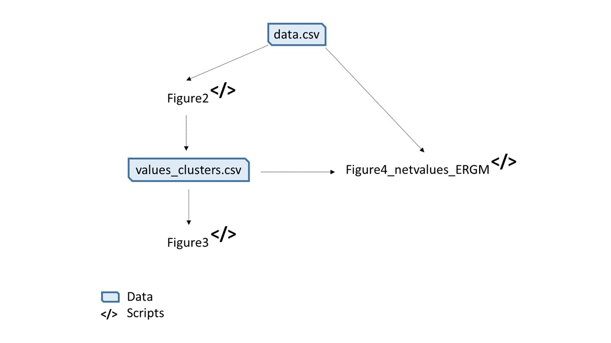

# tropituna_SNA_AdptCapacity

## Description

This repository allows to replicate results from the article *Social connectivity and adaptive capacity strategies in large-scale fisheries*. The scripts in Figure 1 produce all figures from the manuscritp.

**Figure 1. Scripts workflow.** Arrows indicate the necessary data to run scripts. Arrows appearing after one script indicate generation of data by that script.
